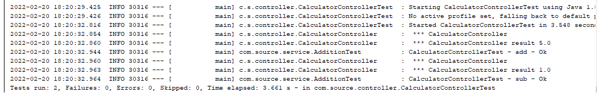
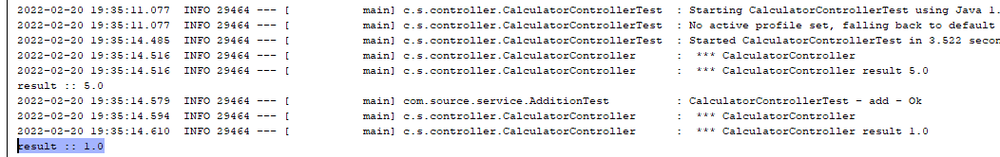

# Prueba técnica
El objetivo de este ejercicio es implementar un microservicio "calculadora", usando maven + spring-boot.

## Requerimiento  
Exponer un API que debe ser capaz, a partir de unos parámetros de entrada, de realizar operaciones aritméticas de sumas y restas de dos elemento.  
Se debe utilizar el jar (tracer-1.0.0) que contiene un API de traceo de operaciones que debe ser invocado por el microservicio para tracear el resultado de la operación.

## Analisis
Se debe ejecutar las siguientes acciones:
- sumar dos numeros
- restar dos numeros
- se invocara una suma o una resta
- una interaz de entrada de datos

## Diseño
Desarrollaremos los siguientes Objetos:
- Addition
- Substration
- Calculator
- DTO
- Controller


## Desarrollo  

TDD AdditionTest  


TDD SubtrationTest  
  
  
  

TDD CalculatorTest  
  
  

TDD CalculatorControllerTest

  

API Add

java -jar target/pruebatecnica.jar

```
curl -X GET http://localhost:8080/api/operation \
   -H 'Content-Type: application/json' \
   -d '{"number1": "2.0","number2": "1.0","operator": "+"}'
```

API Sub

java -jar target/pruebatecnica.jar 

```
curl -X GET http://localhost:8080/api/operation \
   -H 'Content-Type: application/json' \
   -d '{"number1": "2.0","number2": "1.0","operator": "-"}'
```


Creamos el contendor Docker

- creamos el Dockerfile
- compilamos el proyecto
- creamos la imagen: docker build . -t prueba-tecnica
- iniciamos el contenedor: docker run -p 8080:8080 --name=api-operator prueba-tecnica
- ejecutamos via consola:
una suma:
```
curl -X GET http://localhost:8080/api/operation \
   -H 'Content-Type: application/json' \
   -d '{"number1": "2.0","number2": "1.0","operator": "+"}'

   result=3.0
```
una resta:
```
curl -X GET http://localhost:8080/api/operation \
   -H 'Content-Type: application/json' \
   -d '{"number1": "2.0","number2": "1.0","operator": "+"}'

   result=1.0
```

Agregamos la API tracer
Cargamos el jar en el repositorio local
```
mvn install:install-file -Dfile=tracer-1.0.0.jar -DgroupId=io.corp.calculator -DartifactId=TracerImpl -Dversion=1.0.0 -Dpackaging=jar -DgeneratedPom=true
```

Configuramos en maven
``` 
...
        <dependency>
            <groupId>io.corp.calculator</groupId>
            <artifactId>TracerImpl</artifactId>
            <version>1.0.0</version>
        </dependency> 
...

```

Tracer

  

Se agrega un control de Errores, prueba:  
mvn clean install  
java -jar target/pruebatecnica.jar 

```
curl -X GET http://localhost:8080/api/operation \
   -H 'Content-Type: application/json' \
   -d '{"number1": "2.0","number2": "1.0","operator": "x"}'   

```

Respuesta:
```
{"
   statusCode":404,
   "timestamp":"2022-02-22T08:27:10.632+00:00",
   "message":"Operation (x)  not supported! ",
   "description":"uri=/api/operation"
}
```