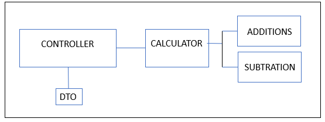
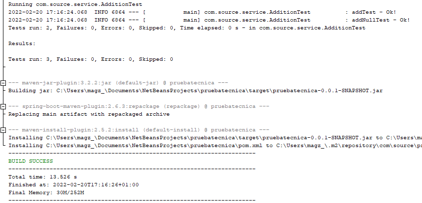
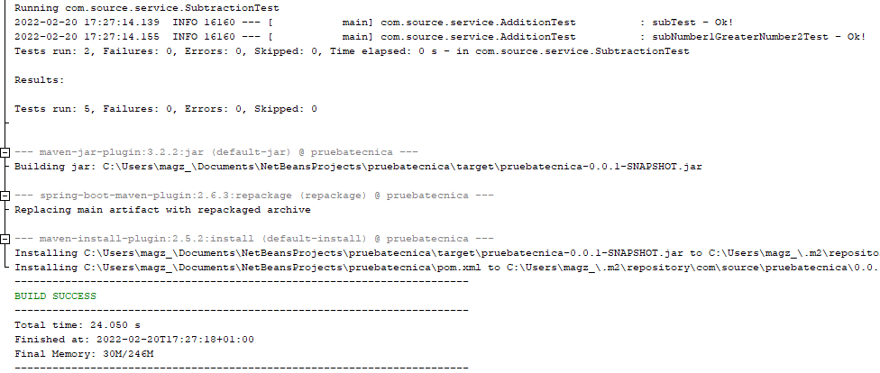
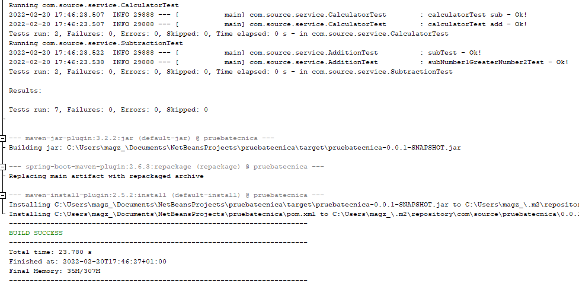

# Prueba técnica
El objetivo de este ejercicio es implementar un microservicio "calculadora", usando maven + spring-boot.

## Requerimiento  
Exponer un API que debe ser capaz, a partir de unos parámetros de entrada, de realizar operaciones aritméticas de sumas y restas de dos elemento.  
Se debe utilizar el jar (tracer-1.0.0) que contiene un API de traceo de operaciones que debe ser invocado por el microservicio para tracear el resultado de la operación.

## Analisis
Se debe ejecutar las siguientes acciones:
- sumar dos numeros
- restar dos numeros
- se invocara una suma o una resta
- una interaz de entrada de datos

## Diseño
Desarrollaremos los siguientes Objetos:
- Addition
- Substration
- Calculator
- DTO
- Controller

## Desarrollo  

TDD AdditionTest  

TDD SubtrationTest  
  
  
  

TDD CalculatorTest  
  
  

