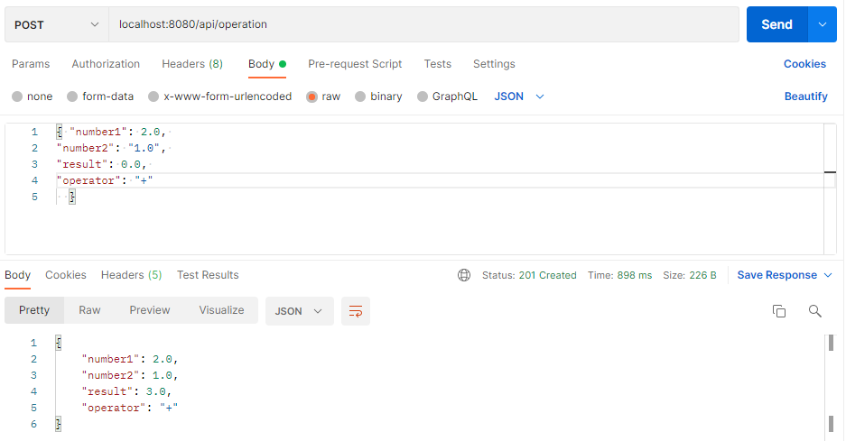

# Prueba técnica
El objetivo de este ejercicio es implementar un microservicio "calculadora", usando maven + spring-boot.

## Requerimiento  
Exponer un API que debe ser capaz, a partir de unos parámetros de entrada, de realizar operaciones aritméticas de sumas y restas de dos elemento.  
Se debe utilizar el jar (tracer-1.0.0) que contiene un API de traceo de operaciones que debe ser invocado por el microservicio para tracear el resultado de la operación.

## Analisis
Se debe ejecutar las siguientes acciones:
- sumar dos numeros
- restar dos numeros
- se invocara una suma o una resta
- una interaz de entrada de datos

## Diseño
Desarrollaremos los siguientes Objetos:
- Addition
- Substration
- Calculator
- DTO
- Controller


## Desarrollo  

TDD AdditionTest  


TDD SubtrationTest  
  
  
  

TDD CalculatorTest  
  
  

TDD CalculatorControllerTest

  

API Add

  

API Sub

  

Creamos el contendor Docker

- creamos el Dockerfile
- compilamos el proyecto
- creamos la imagen: docker build . -t prueba-tecnica
- iniciamos el contenedor: docker run -p 8080:8080 --name=api-operator prueba-tecnica
- ejecutamos via consola:
una suma:
```
curl -X POST http://localhost:8080/api/operation \
   -H 'Content-Type: application/json' \
   -d '{"number1": "2.0","number2": "1.0","result": "0.0","operator": "+"}'

   result=3.0
```
una resta:
```
curl -X POST http://localhost:8080/api/operation \
   -H 'Content-Type: application/json' \
   -d '{"number1": "2.0","number2": "1.0","result": "0.0","operator": "-"}'

   result=1.0
```